# Crypto Statistical Arbitrage (4H Binance Spot): Momentum vs. Short-Horizon Reversal

Research backtest comparing **cross-sectional momentum** vs **short-horizon reversal (mean reversion)** on a liquid **Binance USDT spot** universe using **4-hour candles**, with **turnover-based transaction costs**.

- **Momentum:** winners keep winning (trend continuation)  
- **Reversal:** losers bounce (mean reversion)

> This is a research backtest for learning and evaluation — not investment advice.

---

## Method (high level)
- **Universe:** liquid USDT spot pairs (filtered)
- **Signals:** momentum (lookback `L`) vs reversal (lookback `H`)
- **Portfolio:** cross-sectional long/short (**top 20%** vs **bottom 20%**)
- **Execution:** daily rebalancing, **1-bar lag** (no look-ahead)
- **Costs:** transaction costs modeled from turnover (baseline **20 bps**)

---

## Results (snapshot from latest run)

### Momentum sweep (L ∈ {6, 12, 24, 42, 84, 168})
Momentum was negative across all tested horizons in this sample.

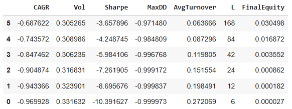

### Reversal sweep (H ∈ {1, 2, 3, 6})
Reversal was strongly positive, with **H=3 (~12 hours)** best in the unfiltered run.

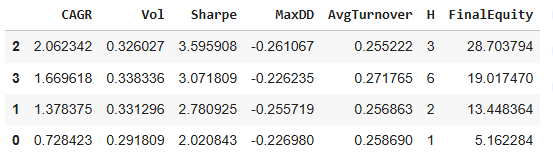

---

## Cost sensitivity (unfiltered reversal, H=3)

| H | cost (bps) | Sharpe | CAGR | MaxDD | AvgTurnover | FinalEquity |
|---:|---:|---:|---:|---:|---:|---:|
| 3 | 20 | 3.596 | 2.062 | -0.261 | 0.255 | 28.704× |
| 3 | 40 | 0.159 | -0.004 | -0.728 | 0.255 | 0.989× |
| 3 | 60 | -2.910 | -0.677 | -0.974 | 0.255 | 0.034× |

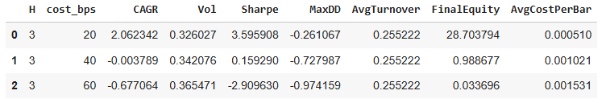

Takeaway: performance is **strong at 20 bps** but **drops sharply** at higher costs → execution matters.

---

## Diagnostic: why reversal appears real (bucket test)
Each bar, assets are ranked by reversal signal and split into **5 buckets** (0=lowest, 4=highest).  
If mean reversion exists, the most “oversold” bucket should bounce more next bar.

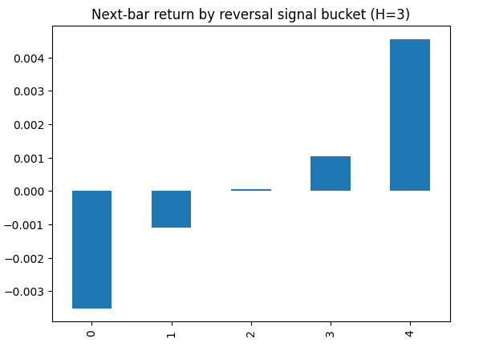

---

## Train/Test split (cutoff 2024-01-01)
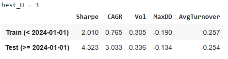

---

## Execution improvement: liquidity filter
Optional filter keeps only assets in the **top 50% of volume rank** each bar (reduces trading in thin / hard-to-trade names).

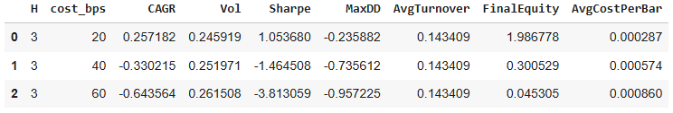

---

## Equity / Turnover / Cost plots

Unfiltered (H=3):
- 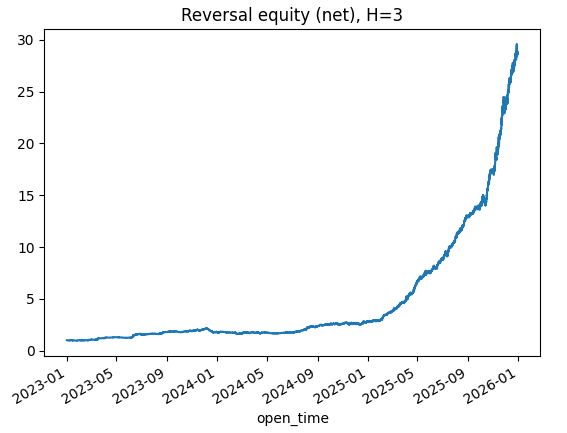
- 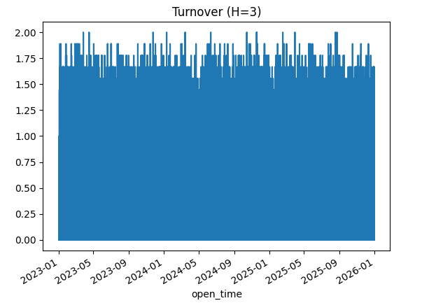
- 

Liquidity-filtered:
- 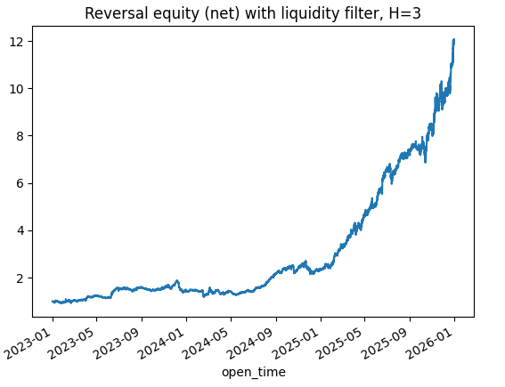
- 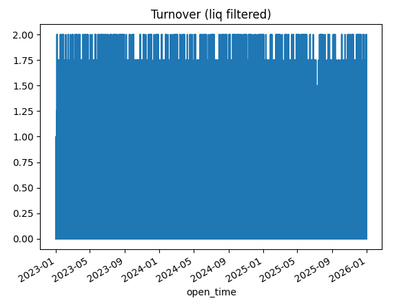
- 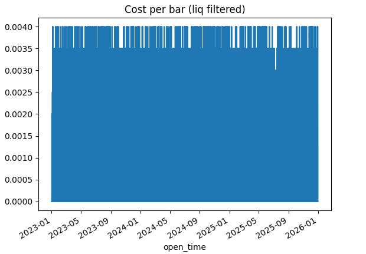

---

## Reproducibility note (why results can change “day to day”)
If you re-download OHLCV or re-filter the universe (coverage, top-volume list, etc.), the **asset set** and **sample period** can shift slightly — changing the best H/L and performance.

To lock results:
1) Freeze a start/end date  
2) Save the universe tickers used  
3) Cache OHLCV locally (parquet/csv) and reuse it

---

## Project structure
```text
.
├── notebooks/
│   └── Crypto_Statistical_Arbitrage.ipynb
├── src/
│   └── crypto_statarb.py
├── figures/
│   └── (pngs used in README / WordPress)
├── requirements.txt
└── .gitignore
